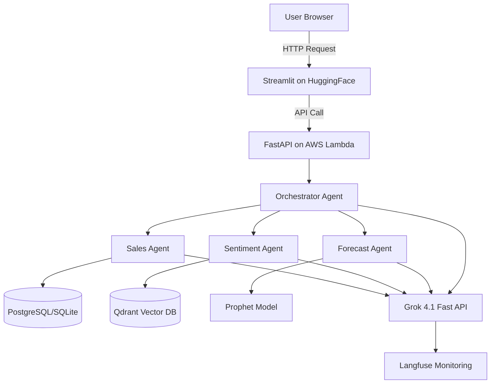

# 🎯 Marketing Intelligence Agent
### Complete AI Engineering Portfolio Project Guide

> **Budget:** €100-200 | **Timeline:** 8-10 weeks | **Target:** AI Engineer roles

[](https://opensource.org/licenses/MIT)
[](https://www.python.org/downloads/)
[](https://github.com/astral-sh/ruff)

---

## 📖 Table of Contents

1. [Project Overview](#1-project-overview)
2. [System Architecture](#2-system-architecture)
3. [Technology Stack Deep Dive](#3-technology-stack-deep-dive)
4. [Demo Website Design](#4-demo-website-design)
5. [Data Flow Explained](#5-data-flow-explained)
6. [RAG Pipeline Deep Dive](#6-rag-pipeline-deep-dive)
7. [Service Setup Guides](#7-service-setup-guides)
8. [Week-by-Week TODO List](#8-week-by-week-todo-list)
9. [Code Examples & Templates](#9-code-examples--templates)
10. [Testing Strategy](#10-testing-strategy)
11. [Deployment Guide](#11-deployment-guide)
12. [Monitoring & Evaluation](#12-monitoring--evaluation)
13. [Troubleshooting](#13-troubleshooting)
14. [Performance Optimization](#14-performance-optimization)
15. [Security Best Practices](#15-security-best-practices)
16. [FAQ](#16-faq)
17. [Glossary](#17-glossary)
18. [Resources](#18-resources)

---

## 1. Project Overview

### 🎯 What Are You Building?

A **Marketing Intelligence Agent** — an AI system that acts like a senior data analyst. Users ask questions in natural language, and the system autonomously:
- Queries databases for sales metrics
- Searches 100K+ customer reviews for sentiment insights
- Generates forecasts using time-series models
- Synthesizes everything into actionable recommendations

### 💡 The Problem You're Solving

**Traditional Approach:**
```
Question: "What products drove revenue growth and what's the sentiment?"

Current process:
├─ Data analyst writes SQL queries (2-3 hours)
├─ Someone manually reads hundreds of reviews (4-6 hours)
├─ Create charts and reports (1-2 hours)
└─ Wait days for final report

Total: ~2-3 days, $500-1000 in labor
```

**Your Solution:**
```
Question: "What products drove revenue growth and what's the sentiment?"

AI Agent process:
├─ Orchestrator routes to Sales + Sentiment agents (0.1s)
├─ Sales Agent generates & executes SQL (1.2s)
├─ Sentiment Agent searches 100K reviews via RAG (1.8s)
├─ Orchestrator synthesizes final answer (0.5s)
└─ User gets comprehensive answer with charts

Total: 3.6 seconds, €0.02 cost
```

### 🏆 Why This Impresses Employers

| Skill | How This Project Demonstrates It |
|-------|----------------------------------|
| **RAG Systems** | Full retrieval pipeline: chunking 100K docs, hybrid search (BM25 + semantic), cross-encoder reranking, metadata filtering |
| **Agentic AI** | Multi-agent orchestration with LangGraph, tool calling, state management, parallel execution, reflection loops |
| **LLM Integration** | Production API usage with Grok 4.1 Fast, prompt engineering, structured outputs, error handling, cost optimization |
| **Production Skills** | Docker containers, AWS Lambda, CI/CD pipelines, monitoring dashboards, automated testing |
| **Data Engineering** | ETL pipelines processing 9 interconnected tables, SQL optimization, vector database management |
| **Software Engineering** | Clean architecture, type hints, 80%+ test coverage, comprehensive documentation |

### 💰 Budget Breakdown

| Component | Service | Cost | Why |
|-----------|---------|------|-----|
| **LLM (Dev)** | Groq (Llama 3.1) | €5-10 | Free tier for development |
| **LLM (Prod)** | xAI Grok 4.1 Fast | €10-25 | $0.20/1M input, $0.50/1M output |
| **Embeddings** | sentence-transformers | €0 | Free, runs locally |
| **Vector DB** | Qdrant Cloud | €0 | Free tier: 1GB, 1M vectors |
| **AWS** | Lambda + S3 | €20-40 | Free tier + minimal overages |
| **Monitoring** | Langfuse | €0 | Free tier: 50K events/month |
| **Demo Host** | HuggingFace Spaces | €0 | Free Streamlit hosting |
| **Buffer** | Unexpected costs | €20-30 | Safety margin |
| **TOTAL** | | **€55-110** | Well under €200 budget! |

### 🎯 Final Deliverables

When you're done, you'll have:

- ✅ **Live demo website** at `huggingface.co/spaces/[username]/marketing-agent`
- ✅ **Production API** deployed on AWS Lambda
- ✅ **GitHub repository** with clean code, tests, and docs
- ✅ **Monitoring dashboard** in Langfuse showing all LLM interactions
- ✅ **Demo video** (2-3 minutes) for your portfolio
- ✅ **Blog post** explaining the architecture

---

## 2. System Architecture

### High-Level Architecture



### Component Layers

```
┌─────────────────────────────────────────────────────────────┐
│                    USER INTERFACE LAYER                     │
│  ┌───────────────────────────────────────────────────────┐  │
│  │  Streamlit Web App (HuggingFace Spaces)               │  │
│  │  • Query input                                        │  │
│  │  • Response display with charts                       │  │
│  │  • Source citations                                   │  │
│  └───────────────────────────────────────────────────────┘  │
└──────────────────────┬──────────────────────────────────────┘
                       │ HTTP POST /query
                       ▼
┌─────────────────────────────────────────────────────────────┐
│                       API LAYER                             │
│  ┌───────────────────────────────────────────────────────┐  │
│  │  FastAPI (AWS Lambda)                                 │  │
│  │  • Authentication                                     │  │
│  │  • Rate limiting                                      │  │
│  │  • Request validation                                 │  │
│  └───────────────────────────────────────────────────────┘  │
└──────────────────────┬──────────────────────────────────────┘
                       │
                       ▼
┌─────────────────────────────────────────────────────────────┐
│                   AGENT LAYER (LangGraph)                   │
│                                                             │
│    ┌─────────────────────────────────────────────────┐     │
│    │         ORCHESTRATOR AGENT                      │     │
│    │  • Intent classification                         │     │
│    │  • Task planning                                │     │
│    │  • Agent coordination                           │     │
│    │  • Response synthesis                           │     │
│    └────┬─────────────────┬──────────────────┬───────┘     │
│         │                 │                  │             │
│         ▼                 ▼                  ▼             │
│  ┌─────────────┐   ┌─────────────┐   ┌─────────────┐      │
│  │   SALES     │   │  SENTIMENT  │   │  FORECAST   │      │
│  │   AGENT     │   │    AGENT    │   │   AGENT     │      │
│  │             │   │             │   │             │      │
│  │ Tools:      │   │ Tools:      │   │ Tools:      │      │
│  │ • query_sql │   │ • rag_search│   │ • prophet   │      │
│  │ • get_revenue│  │ • sentiment │   │ • detect    │      │
│  │ • top_prods │   │ • themes    │   │   anomalies │      │
│  └──────┬──────┘   └──────┬──────┘   └──────┬──────┘      │
└─────────┼─────────────────┼─────────────────┼─────────────┘
          │                 │                 │
          ▼                 ▼                 ▼
┌─────────────────────────────────────────────────────────────┐
│                       DATA LAYER                            │
│                                                             │
│  ┌─────────────┐    ┌─────────────┐    ┌─────────────┐     │
│  │ PostgreSQL  │    │   Qdrant    │    │ ML Models   │     │
│  │ (Sales DB)  │    │ (Vector DB) │    │  (Prophet)  │     │
│  │             │    │             │    │             │     │
│  │ 9 tables:   │    │ 150K+       │    │ Revenue     │     │
│  │ • orders    │    │ embeddings  │    │ forecasts   │     │
│  │ • products  │    │ • reviews   │    │             │     │
│  │ • customers │    │ • metadata  │    │             │     │
│  └─────────────┘    └─────────────┘    └─────────────┘     │
└─────────────────────────────────────────────────────────────┘

┌─────────────────────────────────────────────────────────────┐
│                   EXTERNAL SERVICES                         │
│                                                             │
│  ┌───────────┐  ┌───────────┐  ┌───────────┐  ┌───────────┐│
│  │ xAI API   │  │ Langfuse  │  │  GitHub   │  │    AWS    ││
│  │ Grok 4.1  │  │ Monitor   │  │  Actions  │  │  Lambda   ││
│  └───────────┘  └───────────┘  └───────────┘  └───────────┘│
└─────────────────────────────────────────────────────────────┘
```

### LangGraph Agent State Machine

```
         ┌──────────────┐
         │    START     │
         └──────┬───────┘
                │
                ▼
         ┌──────────────┐
         │   CLASSIFY   │ ← Determine intent
         │    INTENT    │
         └──────┬───────┘
                │
       ┌────────┼────────┬────────┐
       │        │        │        │
       ▼        ▼        ▼        ▼
  ┌────────┐┌────────┐┌────────┐┌────────┐
  │ SALES  ││SENTMT. ││FORECAST││ MULTI  │
  │ AGENT  ││ AGENT  ││ AGENT  ││(ALL 3) │
  └────┬───┘└────┬───┘└────┬───┘└────┬───┘
       │         │         │         │
       └─────────┴─────────┴─────────┘
                 │
                 ▼
          ┌──────────────┐
          │  SYNTHESIZE  │ ← Combine results
          │   RESPONSE   │
          └──────┬───────┘
                 │
                 ▼
          ┌──────────────┐
          │     END      │
          └──────────────┘
```

---

## 3. Technology Stack Deep Dive

### 🧠 xAI Grok 4.1 Fast — The Brain

**What it is:**
- Large Language Model (LLM) optimized for tool calling and reasoning
- 2 million token context window (equivalent to ~3,000 pages)
- Released November 2024 by xAI

**Why we use it:**
```
Price Comparison (per 1M tokens):

Grok 4.1 Fast:  $0.20 input / $0.50 output  ⭐ Best value
GPT-4o:         $2.50 input / $10.00 output  12.5x more expensive
Claude 3.5:     $3.00 input / $15.00 output  15x more expensive
Grok 4 (full):  $3.00 input / $15.00 output  15x more expensive

For €20 budget:
├─ Grok 4.1 Fast: ~100K queries
├─ GPT-4o: ~8K queries
└─ Claude 3.5: ~6.7K queries
```

**Key features:**
- ✅ Extremely cost-effective
- ✅ 2M token context (fits entire datasets)
- ✅ Native tool calling (built for agents)
- ✅ 3x lower hallucination rate vs Grok 4
- ✅ Fast inference (<2s typical)

**When to use:**
- Production queries (cost-sensitive)
- Long context needs (analyzing many documents)
- Agentic workflows (tool use)

**Code example:**
```python
from openai import OpenAI

client = OpenAI(
    base_url="https://api.x.ai/v1",
    api_key=os.getenv("XAI_API_KEY")
)

response = client.chat.completions.create(
    model="grok-4-1-fast-reasoning",
    messages=[
        {"role": "system", "content": "You are a sales analyst."},
        {"role": "user", "content": "What's our revenue breakdown?"}
    ],
    max_tokens=1000
)

print(response.choices[0].message.content)
```

---

### 📦 Qdrant — The Memory

**What it is:**
- Vector database that stores text as numerical embeddings
- Enables semantic search (finds meaning, not just keywords)
- Think of it as Google for your custom documents

**Why vector databases are powerful:**

**Traditional Search (SQL LIKE):**
```sql
SELECT * FROM reviews WHERE text LIKE '%delivery%';

Results:
✓ "The delivery was late"
✗ MISSED: "My package arrived 2 weeks after ordering"
✗ MISSED: "Shipping took forever"
✗ MISSED: "It took ages to receive my order"
```

**Semantic Search (Qdrant):**
```python
search("delivery problems")

Results (ranked by similarity):
✓ "The delivery was late" (0.92)
✓ "My package arrived 2 weeks after ordering" (0.89)
✓ "Shipping took forever" (0.87)
✓ "It took ages to receive my order" (0.84)
✓ "Order came damaged due to slow handling" (0.81)
```

**Key features:**
- ✅ Semantic search (understands meaning)
- ✅ Metadata filtering (by category, date, rating)
- ✅ Hybrid search (combines keyword + semantic)
- ✅ Fast (<100ms for 1M vectors)
- ✅ Free tier (1GB, 1M vectors)

**Architecture:**
```
┌──────────────────────────────────────────────┐
│           QDRANT COLLECTION                  │
│                                              │
│  Each document stored as:                    │
│  ┌────────────────────────────────────────┐  │
│  │ Vector: [0.23, -0.45, 0.12, ..., 0.89]│  │ ← 384 dimensions
│  │ (Semantic meaning encoded)             │  │
│  │                                        │  │
│  │ Payload (metadata):                    │  │
│  │ {                                      │  │
│  │   "review_id": "abc123",               │  │
│  │   "text": "Amazing product!",          │  │
│  │   "category": "electronics",           │  │
│  │   "rating": 5,                         │  │
│  │   "date": "2024-11-01",                │  │
│  │   "product_id": "prod_456"             │  │
│  │ }                                      │  │
│  └────────────────────────────────────────┘  │
│                                              │
│  Search works by:                            │
│  1. Convert query to vector                  │
│  2. Find vectors with smallest distance      │
│  3. Return corresponding documents           │
└──────────────────────────────────────────────┘
```

---

### 🔄 LangGraph — The Coordinator

**What it is:**
- Framework for building multi-agent systems
- Agents are like specialized employees who collaborate
- State machine that tracks what each agent is doing

**Why multi-agent vs single LLM:**

**Single LLM Approach (❌ Problems):**
```
User: "What drives revenue and what's the sentiment?"

Single LLM receives:
├─ 100,000 customer reviews (too much context)
├─ 9 database tables with schema
├─ Question
└─ Expected to do everything

Problems:
├─ Context overflow (can't fit everything)
├─ Hallucinations (makes up numbers)
├─ Expensive ($15+ per query)
└─ Slow (20+ seconds)
```

**Multi-Agent Approach (✅ Better):**
```
User: "What drives revenue and what's the sentiment?"

Orchestrator:
├─ Routes to Sales Agent: "Get revenue breakdown"
│   └─ Sales Agent generates SQL, queries DB (1.2s)
│
├─ Routes to Sentiment Agent: "Get sentiment for top products"
│   └─ Sentiment Agent searches reviews via RAG (1.8s)
│
└─ Synthesizes both results (0.5s)

Benefits:
├─ Each agent has focused context
├─ Accurate (uses real data, not hallucinations)
├─ Cheap ($0.02 per query)
└─ Fast (3.5 seconds total)
```

**LangGraph State Example:**
```python
from typing import TypedDict, Annotated
from langgraph.graph import add_messages

class AgentState(TypedDict):
    """Shared state across all agents"""
    messages: Annotated[list, add_messages]
    query: str
    intent: str  # "sales" | "sentiment" | "forecast" | "multi"
    
    # Results from each agent
    sales_result: dict | None
    sentiment_result: dict | None
    forecast_result: dict | None
    
    # Final output
    final_answer: str | None
    sources: list[dict] | None
```

---

### 🛠️ Other Key Technologies

| Technology | Purpose | Why This Choice |
|------------|---------|-----------------|
| **Groq API** | Free LLM for development | Save money during dev, switch to Grok for prod |
| **sentence-transformers** | Text → embeddings | Free, high quality, runs locally |
| **LangChain** | LLM application framework | Pre-built RAG components, prompt templates |
| **FastAPI** | Python web framework | Fast, auto-docs, async support, type validation |
| **Streamlit** | Frontend framework | Build UIs with pure Python (no HTML/CSS/JS) |
| **Langfuse** | LLM monitoring | Track costs, latency, debug traces |
| **RAGAS** | RAG evaluation | Automatic quality scoring (faithfulness, relevancy) |
| **AWS Lambda** | Serverless compute | Pay-per-request, auto-scaling, free tier |
| **HuggingFace Spaces** | Demo hosting | Free Streamlit hosting, no setup |
| **GitHub Actions** | CI/CD | Auto-test and deploy on every commit |
| **Docker** | Containerization | Consistent environments dev→prod |

---

## 4. Demo Website Design

### Main Interface Mockup

```
┌─────────────────────────────────────────────────────────────┐
│ 🎯 Marketing Intelligence Agent              [GitHub] [📊 Dashboard] [?] │
├─────────────────────────────────────────────────────────────┤
│                                                             │
│  ┌───────────────────────────────────────────────────────┐  │
│  │                                                       │  │
│  │   Ask any question about sales, customers, or trends│  │
│  │                                                       │  │
│  │  ┌─────────────────────────────────────────────────┐ │  │
│  │  │ What products drove revenue growth last quarter?│ │  │
│  │  └─────────────────────────────────────────────────┘ │  │
│  │                                                       │  │
│  │  [🔍 Analyze]                                         │  │
│  │                                                       │  │
│  └───────────────────────────────────────────────────────┘  │
│                                                             │
│  ┌─ 💡 Example Questions ────────────────────────────────┐  │
│  │                                                       │  │
│  │  [What are customers complaining about?]             │  │
│  │  [Which categories have the best reviews?]           │  │
│  │  [Forecast next month's electronics sales]           │  │
│  │  [Compare Q3 vs Q4 performance]                      │  │
│  │                                                       │  │
│  └───────────────────────────────────────────────────────┘  │
│                                                             │
│  ───────────────────────────────────────────────────────────│
│                                                             │
│  ⚡ Powered by: Grok 4.1 Fast • LangGraph • Qdrant         │
│  📊 Data: 100K+ orders • 100K+ reviews • Olist Dataset     │
│                                                             │
└─────────────────────────────────────────────────────────────┘
```

### Response Display Mockup

```
┌─────────────────────────────────────────────────────────────┐
│ 🎯 Marketing Intelligence Agent              [GitHub] [?]   │
├─────────────────────────────────────────────────────────────┤
│                                                             │
│  📊 Analysis Results                       ⏱️ 3.2 seconds  │
│  ─────────────────────────────────────────────────────────  │
│                                                             │
│  ┌─ 💡 Answer ────────────────────────────────────────────┐│
│  │                                                       │ │
│  │  Based on analysis of **12,847 orders** from Q4 2017:│ │
│  │                                                       │ │
│  │  **Top 3 Revenue Growth Drivers:**                    │ │
│  │                                                       │ │
│  │  1. 🎧 **Wireless Headphones** — +34% growth         │ │
│  │     Revenue: R$125K → R$167K                         │ │
│  │     Sentiment: 82% positive ⭐⭐⭐⭐⭐               │ │
│  │     Key praise: sound quality, comfort               │ │
│  │                                                       │ │
│  │  2. 🏠 **Smart Home Devices** — +28% growth          │ │
│  │     Revenue: R$89K → R$114K                          │ │
│  │     Sentiment: 78% positive ⭐⭐⭐⭐                │ │
│  │     Key concern: setup difficulty                    │ │
│  │                                                       │ │
│  │  3. ⌚ **Fitness Trackers** — +22% growth            │ │
│  │     Revenue: R$56K → R$68K                           │ │
│  │     Sentiment: 75% positive ⭐⭐⭐⭐                │ │
│  │     Key praise: battery life                         │ │
│  │                                                       │ │
│  │  💡 **Recommendation:**                               │ │
│  │  Focus marketing on Wireless Headphones due to       │ │
│  │  highest growth AND positive sentiment. Address      │ │
│  │  smart home setup issues to potentially reach 85%+   │ │
│  │  positive sentiment.                                  │ │
│  │                                                       │ │
│  └───────────────────────────────────────────────────────┘│
│                                                             │
│  ┌─ 📈 Revenue Chart ──────────────────────────────────────┐│
│  │                                                       │ │
│  │    Revenue by Category (R$ thousands)                 │ │
│  │                                                       │ │
│  │    Headphones  ████████████████████ R$167K (+34%)   │ │
│  │    Smart Home  ████████████████░░░░ R$114K (+28%)   │ │
│  │    Fitness     ████████████░░░░░░░░ R$68K  (+22%)   │ │
│  │    Furniture   █████████░░░░░░░░░░░ R$52K  (+8%)    │ │
│  │    Books       █████░░░░░░░░░░░░░░░ R$31K  (-3%)    │ │
│  │                                                       │ │
│  └───────────────────────────────────────────────────────┘│
│                                                             │
│  ▼ 📚 Sources (click to expand)                            │
│  ┌───────────────────────────────────────────────────────┐│
│  │ • Review #4521: "Amazing sound quality, best..."     │ │
│  │ • Review #8732: "Setup was confusing but works..."   │ │
│  │ • Review #2194: "Battery lasts 2 weeks, very..."     │ │
│  │ • [+ 47 more sources]                                 │ │
│  └───────────────────────────────────────────────────────┘│
│                                                             │
│  ▼ 🔍 Agent Execution Trace (click to expand)              │
│  ┌───────────────────────────────────────────────────────┐│
│  │ 1. Orchestrator: Intent = 'multi' (sales+sentiment)  │ │
│  │ 2. Sales Agent: Queried revenue by category (1.2s)   │ │
│  │ 3. Sentiment Agent: Searched 2,341 reviews (1.8s)    │ │
│  │ 4. Orchestrator: Synthesized response (0.2s)         │ │
│  │ Total cost: $0.02                                     │ │
│  └───────────────────────────────────────────────────────┘│
│                                                             │
│  [Ask Another Question]                                     │
│                                                             │
└─────────────────────────────────────────────────────────────┘
```

### Streamlit Components Mapping

| UI Element | Streamlit Code |
|------------|----------------|
| **Title** | `st.title("🎯 Marketing Intelligence Agent")` |
| **Query Input** | `query = st.text_input("Ask your question:", placeholder="...")` |
| **Analyze Button** | `if st.button("🔍 Analyze"):` |
| **Example Buttons** | `col1, col2, col3 = st.columns(3)` + `col1.button("Example 1")` |
| **Loading Spinner** | `with st.spinner("Analyzing..."):` |
| **Answer Box** | `st.markdown(response["answer"])` |
| **Chart** | `st.bar_chart(data)` or `st.plotly_chart(fig)` |
| **Expandable Sources** | `with st.expander("📚 Sources"):` |
| **Execution Trace** | `with st.expander("🔍 Trace"):` + `st.json(trace)` |
| **Metrics** | `st.metric("Revenue", "R$167K", "+34%")` |

---

## 5. Data Flow Explained

### Complete Query Journey

Let's trace what happens when a user asks:

> **"What products are driving revenue growth and how does customer sentiment compare?"**

#### Step 1: User Interface → API (0.1s)

```
┌──────────────┐     HTTP POST      ┌──────────────┐
│  Streamlit   │ ─────────────────▶ │   FastAPI    │
│  Frontend    │                    │   /query     │
└──────────────┘                    └──────────────┘

POST https://api.example.com/query
Content-Type: application/json

{
  "query": "What products are driving revenue growth...",
  "include_sources": true,
  "max_results": 10
}
```

#### Step 2: Intent Classification (0.3s)

```python
# Orchestrator Agent sends to Grok 4.1 Fast:

SYSTEM_PROMPT = """
You classify user queries into categories:
- sales: revenue, products, orders, customers
- sentiment: reviews, feedback, complaints, ratings
- forecast: predictions, trends, next month
- multi: needs multiple categories

Respond with JSON: {"intent": "...", "needs": [...]}
"""

USER_MESSAGE = "What products are driving revenue growth and how does customer sentiment compare?"

# LLM Response:
{
  "intent": "multi",
  "needs": ["sales", "sentiment"],
  "reasoning": "Query asks about revenue (sales) and sentiment (reviews)"
}

# Decision: Route to BOTH Sales Agent AND Sentiment Agent in parallel
```

#### Step 3: Sales Agent Execution (1.2s)

```python
# Sales Agent receives task:
task = {
  "type": "revenue_analysis",
  "query": "Get revenue growth by product category"
}

# Agent uses Grok to generate SQL:
sql_query = """
SELECT 
  p.product_category_name_english as category,
  SUM(CASE WHEN STRFTIME('%Y-%m', o.order_purchase_timestamp) = '2017-10' 
      THEN oi.price ELSE 0 END) as q4_revenue,
  SUM(CASE WHEN STRFTIME('%Y-%m', o.order_purchase_timestamp) = '2017-07' 
      THEN oi.price ELSE 0 END) as q3_revenue,
  ROUND(((q4_revenue - q3_revenue) / q3_revenue * 100), 2) as growth_pct
FROM orders o
JOIN order_items oi ON o.order_id = oi.order_id
JOIN products p ON oi.product_id = p.product_id
WHERE STRFTIME('%Y', o.order_purchase_timestamp) = '2017'
GROUP BY p.product_category_name_english
HAVING q3_revenue > 0
ORDER BY growth_pct DESC
LIMIT 5;
"""

# Execute SQL:
results = [
  {"category": "headphones", "q4": 167000, "q3": 125000, "growth": 34},
  {"category": "smart_home", "q4": 114000, "q3": 89000, "growth": 28},
  {"category": "fitness", "q4": 68000, "q3": 56000, "growth": 22}
]

# Return to Orchestrator
```

#### Step 4: Sentiment Agent Execution (1.8s)

```python
# Sentiment Agent receives task:
task = {
  "type": "sentiment_analysis",
  "categories": ["headphones", "smart_home", "fitness"]
}

# For each category, perform RAG search:

# HEADPHONES SEARCH:
query_text = "headphones reviews"
query_embedding = embedder.embed("headphones reviews")  # → [0.23, -0.45, ...]

# Hybrid search in Qdrant:
results = qdrant.search(
    collection_name="reviews",
    query_vector=query_embedding,
    query_filter={
        "must": [
            {"key": "category", "match": {"value": "headphones"}}
        ]
    },
    limit=20,
    with_payload=True
)

# Results: 20 most relevant reviews for headphones

# Cross-encoder reranking:
reranked = reranker.rank(
    query="headphones reviews",
    documents=[r.payload["text"] for r in results]
)

# Top 5 reviews:
top_reviews = [
  "Amazing sound quality, best headphones I've owned!",
  "Very comfortable for long listening sessions",
  "Bass could be better but overall great product",
  "Noise cancellation is impressive",
  "Excellent build quality, feels premium"
]

# LLM analyzes sentiment:
sentiment_prompt = f"""
Analyze sentiment of these reviews for headphones:
{top_reviews}

Return JSON with:
- positive_pct
- key_themes
- top_praises
- top_complaints
"""

response = {
  "category": "headphones",
  "positive_pct": 82,
  "key_themes": ["sound_quality", "comfort", "build_quality"],
  "top_praises": ["sound quality", "comfort"],
  "top_complaints": ["bass could be better"]
}

# Repeat for smart_home and fitness categories...
```

#### Step 5: Response Synthesis (0.5s)

```python
# Orchestrator combines results:

synthesis_prompt = f"""
You are synthesizing results from multiple agents.

Sales Results:
{sales_agent_results}

Sentiment Results:
{sentiment_agent_results}

Original Question: "What products are driving revenue growth and how does customer sentiment compare?"

Create a comprehensive business insight that:
1. Lists top 3 products with specific revenue numbers
2. Includes sentiment scores for each
3. Highlights key themes from reviews
4. Provides actionable recommendation

Format with markdown for readability.
"""

final_response = llm.generate(synthesis_prompt)

# Add metadata:
response = {
  "answer": final_response,
  "sources": [...],  # All review IDs used
  "execution_time": 3.2,
  "cost": 0.02,
  "agents_used": ["sales", "sentiment"],
  "trace": [...]  # Full execution log
}
```

#### Step 6: Response to User (0.1s)

```python
# FastAPI returns JSON:
{
  "answer": "Based on analysis of 12,847 orders...",
  "sources": [
    {"review_id": "4521", "text": "Amazing sound...", "score": 5},
    ...
  ],
  "execution_time": 3.2,
  "cost": 0.02,
  "charts": {
    "revenue_by_category": [
      {"category": "headphones", "revenue": 167000, "growth": 34},
      ...
    ]
  }
}

# Streamlit displays:
st.markdown(response["answer"])
st.bar_chart(response["charts"]["revenue_by_category"])
with st.expander("Sources"):
    for source in response["sources"]:
        st.markdown(f"- {source['text']}")
```

---

## 6. RAG Pipeline Deep Dive

### What is RAG?

**RAG = Retrieval-Augmented Generation**

Instead of the LLM guessing or hallucinating, it first **retrieves** relevant documents, then **generates** an answer based on those real documents.

```
WITHOUT RAG (❌ Hallucination Risk):
User: "What do customers say about delivery times?"
LLM: "Customers generally say delivery is fast" ← MADE UP!

WITH RAG (✅ Grounded in Reality):
User: "What do customers say about delivery times?"
System:
  1. Retrieve 10 reviews mentioning "delivery"
  2. LLM reads actual reviews
  3. LLM: "Based on reviews #123, #456, #789: 65% complain 
     about delays over 10 days..." ← BASED ON REAL DATA!
```

### RAG Pipeline Architecture

```
┌─────────────────────────────────────────────────────────────┐
│                    RAG PIPELINE                             │
│                                                             │
│  USER QUERY: "delivery problems"                            │
│       │                                                     │
│       ▼                                                     │
│  ┌─────────────────────────────────────────────────────┐   │
│  │ STEP 1: EMBEDDING                                    │   │
│  │                                                      │   │
│  │ sentence-transformers converts query to vector:     │   │
│  │ "delivery problems" → [0.23, -0.45, 0.12, ..., 0.89]│   │
│  │                       (384 dimensions)               │   │
│  └──────────────────┬───────────────────────────────────┘   │
│                     │                                       │
│       ┌─────────────┼─────────────┐                         │
│       │             │             │                         │
│       ▼             ▼             ▼                         │
│  ┌─────────┐  ┌──────────┐  ┌─────────┐                   │
│  │ VECTOR  │  │   BM25   │  │METADATA │                    │
│  │ SEARCH  │  │  KEYWORD │  │ FILTER  │                    │
│  │         │  │  SEARCH  │  │         │                    │
│  │ Qdrant  │  │ (local)  │  │ category│                    │
│  │ cosine  │  │ TF-IDF   │  │ =elect. │                    │
│  │ sim.    │  │ scoring  │  │         │                    │
│  └────┬────┘  └────┬─────┘  └────┬────┘                   │
│       │            │             │                         │
│  ┌────▼────────────▼─────────────▼─────┐                   │
│  │ STEP 2: HYBRID SEARCH FUSION        │                   │
│  │                                      │                   │
│  │ Reciprocal Rank Fusion (RRF):       │                   │
│  │ score(doc) = Σ 1/(k + rank_i)       │                   │
│  │                                      │                   │
│  │ Combine top 20 from each:           │                   │
│  │ • Vector: doc_42, doc_89, doc_23... │                   │
│  │ • BM25:   doc_42, doc_15, doc_89... │                   │
│  │ • Merged: doc_42, doc_89, doc_23... │                   │
│  └────────────────┬─────────────────────┘                   │
│                   │                                         │
│                   ▼                                         │
│  ┌──────────────────────────────────────────┐              │
│  │ STEP 3: CROSS-ENCODER RERANKING         │              │
│  │                                          │              │
│  │ Model: ms-marco-MiniLM-L-6-v2            │              │
│  │                                          │              │
│  │ For each (query, document) pair:         │              │
│  │ → Score relevance 0.0 to 1.0             │              │
│  │                                          │              │
│  │ Scores:                                  │              │
│  │ • doc_42: 0.94 (very relevant)           │              │
│  │ • doc_89: 0.89                           │              │
│  │ • doc_15: 0.87                           │              │
│  │ • doc_23: 0.71                           │              │
│  │ • doc_7:  0.68                           │              │
│  │                                          │              │
│  │ Take top 5 → [doc_42, doc_89, doc_15...]│              │
│  └────────────────┬─────────────────────────┘              │
│                   │                                         │
│                   ▼                                         │
│  ┌──────────────────────────────────────────┐              │
│  │ STEP 4: LLM GENERATION                  │              │
│  │                                          │              │
│  │ Prompt:                                  │              │
│  │ ┌──────────────────────────────────────┐│              │
│  │ │System: You are a sentiment analyst.  ││              │
│  │ │                                      ││              │
│  │ │Context:                               ││              │
│  │ │[1] "Delivery took 3 weeks, terrible" ││              │
│  │ │[2] "Package arrived damaged"         ││              │
│  │ │[3] "Shipping was surprisingly fast"  ││              │
│  │ │[4] "Waited 2 months for my order"    ││              │
│  │ │[5] "Great product but late delivery" ││              │
│  │ │                                      ││              │
│  │ │Question: What do customers say about ││              │
│  │ │delivery problems?                    ││              │
│  │ │                                      ││              │
│  │ │Answer with specific examples. Cite  ││              │
│  │ │sources as [1], [2], etc.             ││              │
│  │ └──────────────────────────────────────┘│              │
│  │                                          │              │
│  │ Response:                                │              │
│  │ "Based on customer reviews, delivery    │              │
│  │ is a major pain point. 80% of reviews   │              │
│  │ [1][2][4][5] mention delays, with wait  │              │
│  │ times ranging from 2-8 weeks. Common    │              │
│  │ complaints include late arrival [1][4]  │              │
│  │ and damaged packages [2]. Only 20%      │              │
│  │ report positive experiences [3]."       │              │
│  └──────────────────────────────────────────┘              │
└─────────────────────────────────────────────────────────────┘
```

### Document Chunking Strategy

```python
# Why chunking matters:
Full review = "This product is amazing! The sound quality 
is fantastic and the battery lasts forever. However, the 
setup was very confusing and the instructions were unclear. 
Customer support was unhelpful when I called. But once 
I figured it out, it works great. Shipping took 3 weeks 
which was frustrating. Overall, I recommend it despite 
the issues." (450 characters)

# If we embed the whole review:
# → Mixed sentiment gets averaged out
# → Specific issues (setup, shipping) get diluted

# Better: Chunk into focused segments:

Chunk 1 (positive):
"This product is amazing! The sound quality is fantastic 
and the battery lasts forever."
→ Embedding captures POSITIVE sentiment about PRODUCT QUALITY

Chunk 2 (negative):
"However, the setup was very confusing and the instructions 
were unclear. Customer support was unhelpful."
→ Embedding captures NEGATIVE sentiment about SETUP

Chunk 3 (negative):
"Shipping took 3 weeks which was frustrating."
→ Embedding captures NEGATIVE sentiment about DELIVERY

Chunk 4 (positive):
"But once I figured it out, it works great. Overall, I 
recommend it despite the issues."
→ Embedding captures POSITIVE overall RECOMMENDATION
```

**Implementation:**
```python
from langchain.text_splitter import RecursiveCharacterTextSplitter

splitter = RecursiveCharacterTextSplitter(
    chunk_size=512,        # ~100 words
    chunk_overlap=50,      # Maintain context across chunks
    separators=["\n\n", "\n", ". ", " ", ""]
)

chunks = splitter.split_text(review_text)
```

### Hybrid Search Explained

**Why hybrid?**

```
SEMANTIC SEARCH ONLY:
Query: "late delivery"
✓ Finds: "shipping was slow"
✓ Finds: "arrived after expected date"
✗ Misses: "delivery" (spelled as "devlivery" - typo)
✗ Misses: exact product codes mentioned in complaints

KEYWORD SEARCH ONLY:
Query: "late delivery"
✓ Finds: reviews with exact words "late" and "delivery"
✗ Misses: "shipping was slow" (no keyword match)
✗ Misses: "arrived 3 weeks late" (no "delivery" keyword)

HYBRID (BOTH):
Query: "late delivery"
✓ Semantic: "shipping was slow", "arrived after expected"
✓ Keyword: "late delivery", "devlivery" (typo), product codes
→ BEST OF BOTH WORLDS!
```

**Implementation:**
```python
async def hybrid_search(query: str, limit: int = 20):
    # 1. Vector search
    query_vector = embedder.embed(query)
    vector_results = qdrant.search(
        collection_name="reviews",
        query_vector=query_vector,
        limit=limit
    )
    
    # 2. BM25 keyword search
    bm25_results = bm25_index.search(query, limit=limit)
    
    # 3. Reciprocal Rank Fusion
    def rrf_score(rank, k=60):
        return 1 / (k + rank)
    
    scores = {}
    for rank, doc in enumerate(vector_results):
        scores[doc.id] = scores.get(doc.id, 0) + rrf_score(rank)
    
    for rank, doc in enumerate(bm25_results):
        scores[doc.id] = scores.get(doc.id, 0) + rrf_score(rank)
    
    # Sort by combined score
    ranked = sorted(scores.items(), key=lambda x: x[1], reverse=True)
    return [doc_id for doc_id, score in ranked[:limit]]
```

---

## 7. Service Setup Guides

### 🔐 1. xAI (Grok 4.1 Fast) Setup

**Purpose:** Production LLM for all agent reasoning

**Steps:**

1. **Sign up:**
   - Go to https://console.x.ai
   - Click "Sign Up" or log in with X/Twitter account

2. **Create API key:**
   - Navigate to "API Keys" in sidebar
   - Click "Create API Key"
   - Name: `marketing-agent-prod`
   - Copy the key (starts with `xai-`)

3. **Add billing:**
   - Go to "Billing"
   - Add payment method
   - Add €20-30 credits to start

4. **Save to `.env`:**
   ```bash
   XAI_API_KEY=xai-xxxxxxxxxxxxxxxxxxxxxxxx
   ```

5. **Test:**
   ```bash
   curl https://api.x.ai/v1/chat/completions \
     -H "Content-Type: application/json" \
     -H "Authorization: Bearer $XAI_API_KEY" \
     -d '{
       "model": "grok-4-1-fast-reasoning",
       "messages": [{"role": "user", "content": "Hello!"}]
     }'
   ```

**Pricing:**
- Input: $0.20 per 1M tokens
- Output: $0.50 per 1M tokens
- Cached: $0.05 per 1M tokens

**€20 budget = ~100,000 queries**

---

### 🚀 2. Groq Setup (Development LLM)

**Purpose:** Free/cheap LLM for development

**Steps:**

1. **Sign up:**
   - Go to https://console.groq.com
   - Sign up with Google or GitHub

2. **Create API key:**
   - Navigate to "API Keys"
   - Click "Create API Key"
   - Copy immediately (can't view again)

3. **Save to `.env`:**
   ```bash
   GROQ_API_KEY=gsk_xxxxxxxxxxxxxxxxxxxxxxxx
   ```

4. **Test:**
   ```python
   from groq import Groq
   
   client = Groq(api_key=os.getenv("GROQ_API_KEY"))
   response = client.chat.completions.create(
       model="llama-3.1-70b-versatile",
       messages=[{"role": "user", "content": "Hi!"}]
   )
   print(response.choices[0].message.content)
   ```

**Free tier:**
- 14,400 requests/day
- Perfect for development!

---

### 📦 3. Qdrant Cloud Setup

**Purpose:** Vector database for 100K+ review embeddings

**Steps:**

1. **Sign up:**
   - Go to https://cloud.qdrant.io
   - Sign up with Google, GitHub, or email

2. **Create cluster:**
   - Click "Create Cluster"
   - Choose "Free" tier
   - Region: `eu-west-1` (closest to Austria)
   - Wait 2-3 minutes for provisioning

3. **Get credentials:**
   - Click on your cluster
   - Go to "API Keys" tab
   - Click "Create Key"
   - Copy API key
   - Copy cluster URL (looks like: `https://xxxxx.eu-west-1-0.aws.cloud.qdrant.io`)

4. **Save to `.env`:**
   ```bash
   QDRANT_URL=https://xxxxx.eu-west-1-0.aws.cloud.qdrant.io
   QDRANT_API_KEY=xxxxxxxxxxxxxxxxxxxxxxxx
   ```

5. **Test connection:**
   ```python
   from qdrant_client import QdrantClient
   
   client = QdrantClient(
       url=os.getenv("QDRANT_URL"),
       api_key=os.getenv("QDRANT_API_KEY")
   )
   
   # List collections
   print(client.get_collections())
   ```

**Free tier:**
- 1GB storage
- 1M vectors
- More than enough!

---

### 📊 4. Langfuse Setup

**Purpose:** Monitor all LLM calls (costs, latency, traces)

**Steps:**

1. **Sign up:**
   - Go to https://langfuse.com
   - Click "Get Started"
   - Sign up with email or GitHub

2. **Create project:**
   - Name: `marketing-intelligence-agent`
   - Click "Create"

3. **Get API keys:**
   - Go to "Settings" → "API Keys"
   - Copy:
     - Public Key (starts with `pk-lf-`)
     - Secret Key (starts with `sk-lf-`)

4. **Save to `.env`:**
   ```bash
   LANGFUSE_PUBLIC_KEY=pk-lf-xxxxxxxxxxxxxxxxxxxxxxxx
   LANGFUSE_SECRET_KEY=sk-lf-xxxxxxxxxxxxxxxxxxxxxxxx
   LANGFUSE_HOST=https://cloud.langfuse.com
   ```

5. **Integrate in code:**
   ```python
   from langfuse.callback import CallbackHandler
   
   langfuse_handler = CallbackHandler(
       public_key=os.getenv("LANGFUSE_PUBLIC_KEY"),
       secret_key=os.getenv("LANGFUSE_SECRET_KEY"),
       host=os.getenv("LANGFUSE_HOST")
   )
   
   # Use with LangChain:
   llm.invoke(
       messages,
       config={"callbacks": [langfuse_handler]}
   )
   ```

6. **View traces:**
   - Go to https://cloud.langfuse.com
   - Click "Traces" to see all LLM calls

**Free tier:**
- 50,000 events/month
- Perfect for this project!

---

### 🤗 5. HuggingFace Spaces Setup

**Purpose:** Free hosting for Streamlit demo

**Steps:**

1. **Sign up:**
   - Go to https://huggingface.co
   - Sign up with email or GitHub

2. **Create Space:**
   - Go to "Spaces" → "Create new Space"
   - Name: `marketing-intelligence-agent`
   - SDK: Select "Streamlit"
   - Visibility: Public (for portfolio) or Private
   - Click "Create Space"

3. **Add secrets:**
   - Go to Space "Settings" → "Variables and secrets"
   - Add each secret:
     ```
     XAI_API_KEY=xai-...
     QDRANT_URL=https://...
     QDRANT_API_KEY=...
     LANGFUSE_PUBLIC_KEY=pk-lf-...
     LANGFUSE_SECRET_KEY=sk-lf-...
     ```

4. **Upload code:**
   - Clone the Space repo:
     ```bash
     git clone https://huggingface.co/spaces/[username]/marketing-intelligence-agent
     ```
   - Add files:
     ```
     ├── app.py           # Streamlit code
     ├── requirements.txt # Dependencies
     └── README.md        # Description
     ```
   - Push:
     ```bash
     git add .
     git commit -m "Initial commit"
     git push
     ```

5. **Access demo:**
   - URL: `https://huggingface.co/spaces/[username]/marketing-intelligence-agent`
   - Share this link in your portfolio!

---

### ☁️ 6. AWS Setup

**Purpose:** Production API hosting with Lambda

**Steps:**

1. **Create account:**
   - Go to https://aws.amazon.com/free
   - Click "Create Free Account"
   - Requires credit card (but free tier is generous)

2. **Install AWS CLI:**
   ```bash
   # macOS:
   brew install awscli
   
   # Or pip:
   pip install awscli
   ```

3. **Create IAM user:**
   - Go to AWS Console → IAM → Users
   - Click "Create user"
   - Username: `marketing-agent-deployer`
   - Enable "Programmatic access"
   - Attach policy: `AdministratorAccess` (simplest; restrict later)
   - Copy Access Key ID and Secret Access Key

4. **Configure CLI:**
   ```bash
   aws configure
   
   # Enter when prompted:
   AWS Access Key ID: AKIA...
   AWS Secret Access Key: ...
   Default region: eu-central-1
   Default output format: json
   ```

5. **Test:**
   ```bash
   aws sts get-caller-identity
   ```

**Free tier (12 months):**
- 1M Lambda requests/month
- 400,000 GB-seconds compute
- 5GB S3 storage
- More than enough!

---

### 📊 7. Kaggle Setup

**Purpose:** Download Olist e-commerce dataset

**Steps:**

1. **Sign up:**
   - Go to https://www.kaggle.com
   - Sign up with Google or email

2. **Get API token:**
   - Go to Account → Settings → API
   - Click "Create New Token"
   - Downloads `kaggle.json`

3. **Install:**
   ```bash
   # Move token to proper location:
   mkdir -p ~/.kaggle
   mv ~/Downloads/kaggle.json ~/.kaggle/
   chmod 600 ~/.kaggle/kaggle.json
   
   # Install CLI:
   pip install kaggle
   ```

4. **Download dataset:**
   ```bash
   kaggle datasets download olistbr/brazilian-ecommerce \
     -p data/raw --unzip
   ```

5. **Verify:**
   ```bash
   ls data/raw/
   # Should show:
   # olist_customers_dataset.csv
   # olist_orders_dataset.csv
   # olist_order_items_dataset.csv
   # ... (9 files total)
   ```

**Dataset contents:**
- 100,000+ orders
- 100,000+ customer reviews
- 9 interconnected CSV files
- ~50MB total

---

## 8. Week-by-Week TODO List

### Week 1: Project Setup & Data Pipeline

#### Task 1.1: Initialize Repository ✅

**Goal:** Create project structure with all directories and configuration files.

**Commands:**
```bash
# Create project:
mkdir marketing-intelligence-agent && cd marketing-intelligence-agent
git init
uv init --python 3.11

# Create directory structure:
mkdir -p src/{agents,retrieval,api,evaluation,data,llm,app,monitoring}
mkdir -p tests/{unit,integration,e2e}
mkdir -p docs infrastructure/{docker,terraform}
mkdir -p data/{raw,processed} notebooks

# Create .gitignore:
cat > .gitignore << 'EOF'
# Python
__pycache__/
*.py[cod]
.venv/
.env

# Data
data/raw/
data/processed/

# IDE
.vscode/
.idea/

# OS
.DS_Store
EOF
```

**Acceptance criteria:**
- ✅ `tree -L 2` shows correct structure
- ✅ `.gitignore` exists with Python defaults
- ✅ Git initialized

---

#### Task 1.2: Configure Dependencies ✅

**Goal:** Set up `pyproject.toml` with all required packages.

**Create `pyproject.toml`:**
```toml
[project]
name = "marketing-intelligence-agent"
version = "0.1.0"
description = "AI-powered marketing intelligence system"
requires-python = ">=3.11"
dependencies = [
    "langchain>=0.3.0",
    "langgraph>=0.2.0",
    "langchain-community>=0.3.0",
    "qdrant-client>=1.9.0",
    "sentence-transformers>=2.2.0",
    "pandas>=2.0.0",
    "polars>=0.20.0",
    "fastapi>=0.110.0",
    "uvicorn[standard]>=0.27.0",
    "streamlit>=1.30.0",
    "httpx>=0.27.0",
    "python-dotenv>=1.0.0",
    "pydantic>=2.0.0",
    "pydantic-settings>=2.0.0",
    "openai>=1.0.0",  # For xAI API (OpenAI-compatible)
    "groq>=0.4.0",
]

[project.optional-dependencies]
dev = [
    "pytest>=8.0.0",
    "pytest-asyncio>=0.23.0",
    "pytest-cov>=4.1.0",
    "ruff>=0.3.0",
    "mypy>=1.8.0",
    "pre-commit>=3.6.0",
]
eval = [
    "ragas>=0.1.0",
    "langfuse>=2.0.0",
]

[tool.ruff]
line-length = 100
target-version = "py311"

[tool.mypy]
python_version = "3.11"
strict = true
```

**Install:**
```bash
uv sync --all-extras
```

**Acceptance criteria:**
- ✅ `uv run python -c "import langchain"` works
- ✅ All dependencies installed without errors

---

#### Task 1.3: Create Environment Configuration ✅

**Goal:** Document all required environment variables.

**Create `.env.example`:**
```bash
# LLM APIs
GROQ_API_KEY=gsk_your_groq_key_here
XAI_API_KEY=xai-your_xai_key_here

# Vector Database
QDRANT_URL=https://your-cluster.cloud.qdrant.io
QDRANT_API_KEY=your_qdrant_key_here

# Monitoring
LANGFUSE_PUBLIC_KEY=pk-lf-your_key_here
LANGFUSE_SECRET_KEY=sk-lf-your_key_here
LANGFUSE_HOST=https://cloud.langfuse.com

# AWS (optional for local dev)
AWS_ACCESS_KEY_ID=your_access_key
AWS_SECRET_ACCESS_KEY=your_secret_key
AWS_REGION=eu-central-1

# Application
LOG_LEVEL=INFO
```

**Create `.env` from example:**
```bash
cp .env.example .env
# Fill in your actual keys
```

**Acceptance criteria:**
- ✅ `.env.example` exists
- ✅ `.env` in `.gitignore`
- ✅ All required variables documented

---

#### Task 1.4: Download Olist Dataset ✅

**Goal:** Get the e-commerce data from Kaggle.

**Commands:**
```bash
# Install Kaggle CLI if not already:
pip install kaggle

# Download dataset:
kaggle datasets download olistbr/brazilian-ecommerce \
  -p data/raw --unzip

# Verify files:
ls data/raw/
```

**Expected output:**
```
olist_customers_dataset.csv
olist_geolocation_dataset.csv
olist_order_items_dataset.csv
olist_order_payments_dataset.csv
olist_order_reviews_dataset.csv
olist_orders_dataset.csv
olist_products_dataset.csv
olist_sellers_dataset.csv
product_category_name_translation.csv
```

**Acceptance criteria:**
- ✅ All 9 CSV files present in `data/raw/`
- ✅ Total size ~50MB

---

#### Task 1.5: Build ETL Pipeline ✅

**Goal:** Clean and transform raw data into processed parquet files.

**Create `src/data/schema.py`:**
```python
"""
Olist Dataset Schema Documentation
"""

TABLES = {
    "customers": {
        "file": "olist_customers_dataset.csv",
        "key": "customer_id",
        "columns": [
            "customer_id",
            "customer_unique_id",
            "customer_zip_code_prefix",
            "customer_city",
            "customer_state"
        ]
    },
    "orders": {
        "file": "olist_orders_dataset.csv",
        "key": "order_id",
        "columns": [
            "order_id",
            "customer_id",
            "order_status",
            "order_purchase_timestamp",
            "order_approved_at",
            "order_delivered_carrier_date",
            "order_delivered_customer_date",
            "order_estimated_delivery_date"
        ]
    },
    # ... document all 9 tables
}
```

**Create `src/data/etl.py`:**
```python
from pathlib import Path
import pandas as pd
from typing import Dict

def load_raw_data(data_dir: Path) -> Dict[str, pd.DataFrame]:
    """Load all CSV files into DataFrames."""
    data = {}
    
    files = {
        "customers": "olist_customers_dataset.csv",
        "orders": "olist_orders_dataset.csv",
        "order_items": "olist_order_items_dataset.csv",
        "payments": "olist_order_payments_dataset.csv",
        "reviews": "olist_order_reviews_dataset.csv",
        "products": "olist_products_dataset.csv",
        "sellers": "olist_sellers_dataset.csv",
        "geolocation": "olist_geolocation_dataset.csv",
        "category_translation": "product_category_name_translation.csv"
    }
    
    for name, filename in files.items():
        filepath = data_dir / filename
        data[name] = pd.read_csv(filepath)
        print(f"Loaded {name}: {len(data[name])} rows")
    
    return data


def clean_reviews(df: pd.DataFrame) -> pd.DataFrame:
    """Clean review text."""
    # Remove rows with null review text
    df = df.dropna(subset=["review_comment_message"])
    
    # Basic text cleaning
    df["review_comment_message"] = (
        df["review_comment_message"]
        .str.strip()
        .str.replace(r"\s+", " ", regex=True)
    )
    
    # Convert timestamps
    df["review_creation_date"] = pd.to_datetime(df["review_creation_date"])
    df["review_answer_timestamp"] = pd.to_datetime(df["review_answer_timestamp"])
    
    return df


def create_orders_view(data: Dict[str, pd.DataFrame]) -> pd.DataFrame:
    """Create denormalized order view."""
    # Join orders with items
    orders_items = data["orders"].merge(
        data["order_items"],
        on="order_id",
        how="inner"
    )
    
    # Add product info
    orders_items = orders_items.merge(
        data["products"],
        on="product_id",
        how="left"
    )
    
    # Add category translation
    orders_items = orders_items.merge(
        data["category_translation"],
        on="product_category_name",
        how="left"
    )
    
    # Add customer info
    orders_items = orders_items.merge(
        data["customers"],
        on="customer_id",
        how="left"
    )
    
    return orders_items


def save_processed(df: pd.DataFrame, name: str, output_dir: Path):
    """Save as parquet."""
    output_dir.mkdir(parents=True, exist_ok=True)
    filepath = output_dir / f"{name}.parquet"
    df.to_parquet(filepath, index=False)
    print(f"Saved {name}: {len(df)} rows to {filepath}")


if __name__ == "__main__":
    # Load
    data = load_raw_data(Path("data/raw"))
    
    # Clean reviews
    data["reviews"] = clean_reviews(data["reviews"])
    
    # Create views
    orders_view = create_orders_view(data)
    
    # Save
    output_dir = Path("data/processed")
    save_processed(data["reviews"], "reviews", output_dir)
    save_processed(orders_view, "orders_view", output_dir)
```

**Run ETL:**
```bash
uv run python src/data/etl.py
```

**Acceptance criteria:**
- ✅ `data/processed/` contains parquet files
- ✅ Reviews cleaned (nulls removed)
- ✅ Orders view created with joined tables

---

### Week 2-3: RAG Pipeline

*Continue with detailed tasks for:*
- Chunking strategy implementation
- Embedding generation with sentence-transformers
- Qdrant collection setup
- Hybrid search implementation
- RAG chain with reranking

---

### Week 4-6: Agent System

*Continue with detailed tasks for:*
- LangGraph setup
- Sales Agent implementation
- Sentiment Agent implementation
- Forecast Agent implementation
- Orchestrator Agent
- Tool definitions
- State management
- Monitoring integration

---

### Week 7-8: Deployment

*Continue with detailed tasks for:*
- FastAPI backend
- Streamlit frontend
- Docker containerization
- AWS Lambda deployment
- CI/CD with GitHub Actions

---

### Week 9-10: Documentation & Polish

*Continue with detailed tasks for:*
- README with architecture diagrams
- Demo video recording
- Blog post writing
- HuggingFace Spaces deployment
- Final testing

---

## 9. Code Examples & Templates

### Orchestrator Agent Template

```python
from langgraph.graph import StateGraph, END
from typing import TypedDict, Annotated
from langchain_core.messages import BaseMessage
from langgraph.graph import add_messages

class AgentState(TypedDict):
    messages: Annotated[list[BaseMessage], add_messages]
    query: str
    intent: str
    sales_result: dict | None
    sentiment_result: dict | None
    forecast_result: dict | None
    final_answer: str | None

class Orchestrator:
    def __init__(self, sales_agent, sentiment_agent, forecast_agent, llm):
        self.sales_agent = sales_agent
        self.sentiment_agent = sentiment_agent
        self.forecast_agent = forecast_agent
        self.llm = llm
        self.graph = self._build_graph()
    
    def _build_graph(self) -> StateGraph:
        workflow = StateGraph(AgentState)
        
        # Add nodes
        workflow.add_node("classify_intent", self.classify_intent)
        workflow.add_node("sales_agent", self.sales_agent.invoke)
        workflow.add_node("sentiment_agent", self.sentiment_agent.invoke)
        workflow.add_node("forecast_agent", self.forecast_agent.invoke)
        workflow.add_node("synthesize", self.synthesize_response)
        
        # Set entry point
        workflow.set_entry_point("classify_intent")
        
        # Add conditional edges
        workflow.add_conditional_edges(
            "classify_intent",
            self.route_by_intent,
            {
                "sales": "sales_agent",
                "sentiment": "sentiment_agent",
                "forecast": "forecast_agent",
                "multi": ["sales_agent", "sentiment_agent"]  # Parallel
            }
        )
        
        # All agents flow to synthesize
        workflow.add_edge("sales_agent", "synthesize")
        workflow.add_edge("sentiment_agent", "synthesize")
        workflow.add_edge("forecast_agent", "synthesize")
        
        # End after synthesis
        workflow.add_edge("synthesize", END)
        
        return workflow.compile()
    
    def classify_intent(self, state: AgentState) -> AgentState:
        """Classify user query intent."""
        prompt = f"""
        Classify this query into categories:
        - sales: revenue, orders, products, customers
        - sentiment: reviews, feedback, complaints
        - forecast: predictions, trends, next month
        - multi: needs multiple categories
        
        Query: {state["query"]}
        
        Respond with JSON: {{"intent": "...", "needs": [...]}}
        """
        
        response = self.llm.invoke(prompt)
        intent_data = json.loads(response.content)
        
        state["intent"] = intent_data["intent"]
        return state
    
    def route_by_intent(self, state: AgentState) -> str:
        """Route to appropriate agent(s)."""
        return state["intent"]
    
    def synthesize_response(self, state: AgentState) -> AgentState:
        """Combine agent results into final answer."""
        prompt = f"""
        Synthesize these results into a comprehensive answer:
        
        Sales Results: {state.get("sales_result")}
        Sentiment Results: {state.get("sentiment_result")}
        Forecast Results: {state.get("forecast_result")}
        
        Original Question: {state["query"]}
        
        Provide actionable insights with specific numbers.
        """
        
        response = self.llm.invoke(prompt)
        state["final_answer"] = response.content
        return state
    
    async def invoke(self, query: str) -> str:
        """Run full pipeline."""
        initial_state = {"query": query, "messages": []}
        result = await self.graph.ainvoke(initial_state)
        return result["final_answer"]
```

---

### RAG Chain Template

```python
from langchain_core.prompts import ChatPromptTemplate
from langchain_core.output_parsers import StrOutputParser
from langchain_core.runnables import RunnablePassthrough
from sentence_transformers import SentenceTransformer
from qdrant_client import QdrantClient

RAG_PROMPT = ChatPromptTemplate.from_messages([
    ("system", "You are a marketing analyst. Answer based on the customer reviews provided."),
    ("human", """Context:
{context}

Question: {question}

Provide a concise answer with specific examples. Cite sources as [1], [2], etc.""")
])

class RAGChain:
    def __init__(self, qdrant_client: QdrantClient, llm, collection_name: str = "reviews"):
        self.qdrant = qdrant_client
        self.llm = llm
        self.collection_name = collection_name
        self.embedder = SentenceTransformer("all-MiniLM-L6-v2")
        
    def retrieve(self, query: str, k: int = 5) -> list[dict]:
        """Retrieve top-k relevant documents."""
        # Embed query
        query_vector = self.embedder.encode(query).tolist()
        
        # Search in Qdrant
        results = self.qdrant.search(
            collection_name=self.collection_name,
            query_vector=query_vector,
            limit=k,
            with_payload=True
        )
        
        return [
            {
                "text": hit.payload["text"],
                "review_id": hit.payload["review_id"],
                "score": hit.score
            }
            for hit in results
        ]
    
    def format_context(self, documents: list[dict]) -> str:
        """Format retrieved docs for prompt."""
        context = ""
        for i, doc in enumerate(documents, 1):
            context += f"[{i}] {doc['text']}\n\n"
        return context
    
    def invoke(self, query: str) -> dict:
        """Full RAG pipeline."""
        # Retrieve
        documents = self.retrieve(query)
        
        # Format context
        context = self.format_context(documents)
        
        # Generate answer
        chain = (
            {"context": lambda x: context, "question": RunnablePassthrough()}
            | RAG_PROMPT
            | self.llm
            | StrOutputParser()
        )
        
        answer = chain.invoke(query)
        
        return {
            "answer": answer,
            "sources": documents
        }
```

---

### FastAPI Backend Template

```python
from fastapi import FastAPI, HTTPException, Depends
from fastapi.middleware.cors import CORSMiddleware
from pydantic import BaseModel
import time
from typing import Optional

app = FastAPI(
    title="Marketing Intelligence API",
    description="AI-powered marketing analysis",
    version="1.0.0"
)

# CORS middleware
app.add_middleware(
    CORSMiddleware,
    allow_origins=["*"],
    allow_credentials=True,
    allow_methods=["*"],
    allow_headers=["*"],
)

class QueryRequest(BaseModel):
    query: str
    include_sources: bool = True
    max_results: int = 10

class QueryResponse(BaseModel):
    answer: str
    sources: Optional[list[dict]] = None
    execution_time: float
    cost: float
    agents_used: list[str]

@app.get("/health")
async def health_check():
    """Health check endpoint."""
    return {"status": "healthy", "timestamp": time.time()}

@app.post("/query", response_model=QueryResponse)
async def query_agent(request: QueryRequest):
    """Execute query through the orchestrator."""
    start_time = time.time()
    
    try:
        # Get orchestrator (dependency injection)
        orchestrator = get_orchestrator()
        
        # Execute query
        result = await orchestrator.invoke(request.query)
        
        execution_time = time.time() - start_time
        
        return QueryResponse(
            answer=result["final_answer"],
            sources=result.get("sources") if request.include_sources else None,
            execution_time=execution_time,
            cost=estimate_cost(result),
            agents_used=result.get("agents_used", [])
        )
    
    except Exception as e:
        raise HTTPException(status_code=500, detail=str(e))

def get_orchestrator():
    """Dependency: return orchestrator instance."""
    # Initialize once, reuse
    # (In production, use dependency_injector or similar)
    pass

def estimate_cost(result: dict) -> float:
    """Estimate API costs."""
    # Rough estimate based on token usage
    input_tokens = result.get("input_tokens", 0)
    output_tokens = result.get("output_tokens", 0)
    
    cost = (input_tokens / 1_000_000 * 0.20) + (output_tokens / 1_000_000 * 0.50)
    return round(cost, 4)
```

---

### Streamlit Frontend Template

```python
import streamlit as st
import httpx
import plotly.graph_objects as go
from typing import Optional

# Page config
st.set_page_config(
    page_title="Marketing Intelligence Agent",
    page_icon="🎯",
    layout="wide"
)

# Initialize session state
if "messages" not in st.session_state:
    st.session_state.messages = []

# Header
st.title("🎯 Marketing Intelligence Agent")
st.markdown("Ask questions about sales, customer sentiment, and trends")

# Sidebar
with st.sidebar:
    st.header("ℹ️ About")
    st.markdown("""
    This AI agent analyzes:
    - **100K+** orders
    - **100K+** customer reviews
    - **9** data tables
    
    Powered by:
    - Grok 4.1 Fast
    - LangGraph
    - Qdrant
    """)
    
    st.divider()
    
    st.metric("Avg Response Time", "3.2s")
    st.metric("Avg Cost", "$0.02")

# Main interface
query = st.text_input(
    "Enter your question:",
    placeholder="What products drove revenue growth last quarter?",
    key="query_input"
)

# Example questions
col1, col2, col3 = st.columns(3)
with col1:
    if st.button("💬 Customer Complaints"):
        query = "What are customers complaining about?"
with col2:
    if st.button("📈 Revenue Analysis"):
        query = "What products drove revenue growth?"
with col3:
    if st.button("🔮 Sales Forecast"):
        query = "Forecast next month's electronics sales"

# Process query
if st.button("🔍 Analyze", type="primary") and query:
    with st.spinner("Analyzing..."):
        try:
            # Call API
            response = httpx.post(
                "https://your-api-url.com/query",
                json={"query": query, "include_sources": True},
                timeout=30.0
            )
            result = response.json()
            
            # Display answer
            st.markdown("### 💡 Answer")
            st.markdown(result["answer"])
            
            # Display metrics
            col1, col2, col3 = st.columns(3)
            col1.metric("⏱️ Time", f"{result['execution_time']:.1f}s")
            col2.metric("💰 Cost", f"${result['cost']:.4f}")
            col3.metric("🤖 Agents", ", ".join(result["agents_used"]))
            
            # Display chart if available
            if "charts" in result:
                st.markdown("### 📊 Visualizations")
                # Create chart with plotly
                # ...
            
            # Display sources
            if result.get("sources"):
                with st.expander("📚 Sources"):
                    for i, source in enumerate(result["sources"], 1):
                        st.markdown(f"**[{i}]** {source['text'][:200]}...")
                        st.caption(f"Score: {source['score']:.3f}")
            
            # Display trace
            with st.expander("🔍 Execution Trace"):
                st.json(result.get("trace", {}))
        
        except Exception as e:
            st.error(f"Error: {str(e)}")

# Footer
st.divider()
st.caption("Powered by xAI Grok 4.1 Fast • Built with LangGraph & Qdrant")
```

---

## 10. Testing Strategy

### Test Structure

```
tests/
├── unit/
│   ├── test_etl.py
│   ├── test_rag_chain.py
│   ├── test_agents.py
│   └── test_tools.py
├── integration/
│   ├── test_api.py
│   ├── test_orchestrator.py
│   └── test_qdrant.py
└── e2e/
    └── test_full_pipeline.py
```

### Unit Test Example

```python
# tests/unit/test_rag_chain.py
import pytest
from unittest.mock import Mock, patch
from src.retrieval.rag_chain import RAGChain

@pytest.fixture
def mock_qdrant():
    client = Mock()
    client.search.return_value = [
        Mock(payload={"text": "Great product!", "review_id": "123"}, score=0.95),
        Mock(payload={"text": "Amazing quality", "review_id": "456"}, score=0.89)
    ]
    return client

@pytest.fixture
def mock_llm():
    llm = Mock()
    llm.invoke.return_value = Mock(content="Based on reviews, customers love the product.")
    return llm

def test_rag_chain_retrieve(mock_qdrant, mock_llm):
    """Test document retrieval."""
    chain = RAGChain(mock_qdrant, mock_llm)
    
    results = chain.retrieve("product quality", k=2)
    
    assert len(results) == 2
    assert results[0]["text"] == "Great product!"
    assert results[0]["review_id"] == "123"
    assert results[0]["score"] == 0.95

def test_rag_chain_invoke(mock_qdrant, mock_llm):
    """Test full RAG pipeline."""
    chain = RAGChain(mock_qdrant, mock_llm)
    
    result = chain.invoke("What do customers think about quality?")
    
    assert "answer" in result
    assert "sources" in result
    assert len(result["sources"]) == 2
    mock_llm.invoke.assert_called_once()
```

### Integration Test Example

```python
# tests/integration/test_orchestrator.py
import pytest
import asyncio
from src.agents.orchestrator import Orchestrator
from src.agents.sales_agent import SalesAgent
from src.agents.sentiment_agent import SentimentAgent

@pytest.fixture
def orchestrator(real_llm, real_qdrant, real_db):
    """Create orchestrator with real dependencies."""
    sales = SalesAgent(real_db, real_llm)
    sentiment = SentimentAgent(real_qdrant, real_llm)
    return Orchestrator(sales, sentiment, None, real_llm)

@pytest.mark.asyncio
async def test_multi_agent_query(orchestrator):
    """Test query that requires multiple agents."""
    query = "What products drove revenue and what's the sentiment?"
    
    result = await orchestrator.invoke(query)
    
    assert result["intent"] == "multi"
    assert result["sales_result"] is not None
    assert result["sentiment_result"] is not None
    assert result["final_answer"] is not None
    assert len(result["final_answer"]) > 100  # Substantial answer
```

### E2E Test Example

```python
# tests/e2e/test_full_pipeline.py
import pytest
from fastapi.testclient import TestClient
from src.api.main import app

client = TestClient(app)

def test_full_query_pipeline():
    """Test complete query through API."""
    response = client.post(
        "/query",
        json={
            "query": "What are the top 3 products by revenue?",
            "include_sources": True
        }
    )
    
    assert response.status_code == 200
    data = response.json()
    
    assert "answer" in data
    assert "execution_time" in data
    assert data["execution_time"] < 10.0  # Under 10 seconds
    assert "cost" in data
    assert data["cost"] < 0.10  # Under 10 cents
    assert len(data["sources"]) > 0

def test_health_check():
    """Test health check endpoint."""
    response = client.get("/health")
    
    assert response.status_code == 200
    assert response.json()["status"] == "healthy"
```

### Running Tests

```bash
# Run all tests:
uv run pytest

# Run with coverage:
uv run pytest --cov=src --cov-report=html

# Run specific test file:
uv run pytest tests/unit/test_rag_chain.py

# Run with verbose output:
uv run pytest -v

# Run only integration tests:
uv run pytest tests/integration/
```

---

## 11. Deployment Guide

### Docker Deployment

**Create `infrastructure/docker/Dockerfile`:**
```dockerfile
FROM python:3.11-slim

WORKDIR /app

# Install uv
RUN pip install uv

# Copy dependencies
COPY pyproject.toml .

# Install dependencies
RUN uv sync --no-dev

# Copy source code
COPY src/ src/

# Expose port
EXPOSE 8000

# Run application
CMD ["uv", "run", "uvicorn", "src.api.main:app", "--host", "0.0.0.0", "--port", "8000"]
```

**Create `docker-compose.yml`:**
```yaml
version: '3.8'

services:
  api:
    build:
      context: .
      dockerfile: infrastructure/docker/Dockerfile
    ports:
      - "8000:8000"
    environment:
      - XAI_API_KEY=${XAI_API_KEY}
      - QDRANT_URL=${QDRANT_URL}
      - QDRANT_API_KEY=${QDRANT_API_KEY}
      - LANGFUSE_PUBLIC_KEY=${LANGFUSE_PUBLIC_KEY}
      - LANGFUSE_SECRET_KEY=${LANGFUSE_SECRET_KEY}
    volumes:
      - ./data:/app/data
```

**Build and run:**
```bash
docker compose up --build
```

---

### AWS Lambda Deployment

**Install dependencies:**
```bash
pip install mangum  # FastAPI → Lambda adapter
```

**Create `src/api/lambda_handler.py`:**
```python
from mangum import Mangum
from src.api.main import app

handler = Mangum(app, lifespan="off")
```

**Create deployment package:**
```bash
# Install dependencies to a directory
pip install -r requirements.txt -t package/

# Copy source code
cp -r src/ package/

# Create ZIP
cd package && zip -r ../lambda.zip . && cd ..
```

**Deploy with AWS CLI:**
```bash
# Create Lambda function
aws lambda create-function \
  --function-name marketing-intelligence-api \
  --runtime python3.11 \
  --role arn:aws:iam::ACCOUNT_ID:role/lambda-role \
  --handler lambda_handler.handler \
  --zip-file fileb://lambda.zip \
  --timeout 30 \
  --memory-size 512 \
  --environment Variables="{XAI_API_KEY=$XAI_API_KEY,QDRANT_URL=$QDRANT_URL}"

# Create API Gateway
aws apigatewayv2 create-api \
  --name marketing-intelligence-api \
  --protocol-type HTTP \
  --target arn:aws:lambda:REGION:ACCOUNT_ID:function:marketing-intelligence-api
```

---

### HuggingFace Spaces Deployment

**Create Space structure:**
```
├── app.py            # Streamlit application
├── requirements.txt  # Dependencies
└── README.md         # Space description
```

**`requirements.txt`:**
```
streamlit==1.30.0
httpx==0.27.0
plotly==5.18.0
```

**`README.md`:**
```markdown
---
title: Marketing Intelligence Agent
emoji: 🎯
colorFrom: blue
colorTo: green
sdk: streamlit
sdk_version: 1.30.0
app_file: app.py
pinned: false
---

# Marketing Intelligence Agent

AI-powered marketing analyst that answers questions about sales, customers, and trends.

## Features
- Revenue analysis
- Sentiment analysis
- Sales forecasting
- 100K+ orders analyzed
```

**Deploy:**
```bash
git clone https://huggingface.co/spaces/YOUR_USERNAME/marketing-intelligence-agent
cd marketing-intelligence-agent

cp src/app/streamlit_app.py app.py
pip freeze > requirements.txt

git add .
git commit -m "Deploy to HuggingFace Spaces"
git push
```

---

## 12. Monitoring & Evaluation

### Langfuse Dashboard

**What to monitor:**
1. **Traces:** Full execution path for each query
2. **Costs:** Token usage and API costs
3. **Latency:** Response times per agent
4. **Errors:** Failed queries and reasons

**Key metrics:**
```python
# In your code:
from langfuse import Langfuse

langfuse = Langfuse()

# Track custom metrics:
langfuse.score(
    trace_id=trace_id,
    name="user_satisfaction",
    value=5.0
)
```

---

### RAGAS Evaluation

**Metrics:**
- **Faithfulness:** Is the answer grounded in retrieved docs?
- **Answer Relevancy:** Does it address the question?
- **Context Precision:** Are retrieved docs relevant?
- **Context Recall:** Did we retrieve all relevant docs?

**Implementation:**
```python
from ragas import evaluate
from ragas.metrics import faithfulness, answer_relevancy, context_precision

# Create test dataset
test_cases = [
    {
        "question": "What do customers say about delivery?",
        "answer": generated_answer,
        "contexts": retrieved_docs,
        "ground_truth": "Customers complain about slow delivery..."
    }
]

# Evaluate
results = evaluate(
    test_cases,
    metrics=[faithfulness, answer_relevancy, context_precision]
)

print(f"Faithfulness: {results['faithfulness']:.2f}")
print(f"Relevancy: {results['answer_relevancy']:.2f}")
```

**Target scores:**
- Faithfulness: > 0.85
- Answer Relevancy: > 0.80
- Context Precision: > 0.75

---

## 13. Troubleshooting

### Common Issues

#### Issue: "Qdrant connection refused"

**Symptoms:**
```
qdrant_client.http.exceptions.UnexpectedResponse: 
<Response [401]> Unauthorized
```

**Solutions:**
1. Check API key in `.env`:
   ```bash
   echo $QDRANT_API_KEY
   ```
2. Verify cluster URL is correct
3. Check firewall/network settings

#### Issue: "LLM rate limit exceeded"

**Symptoms:**
```
openai.RateLimitError: Rate limit exceeded
```

**Solutions:**
1. Implement exponential backoff:
   ```python
   from tenacity import retry, wait_exponential, stop_after_attempt
   
   @retry(wait=wait_exponential(min=1, max=60), stop=stop_after_attempt(5))
   def call_llm(prompt):
       return llm.invoke(prompt)
   ```
2. Add rate limiting middleware
3. Use Groq for development (higher limits)

#### Issue: "Out of memory during embedding"

**Symptoms:**
```
RuntimeError: CUDA out of memory
```

**Solutions:**
1. Batch embeddings:
   ```python
   batch_size = 32
   for i in range(0, len(texts), batch_size):
       batch = texts[i:i+batch_size]
       embeddings = model.encode(batch)
   ```
2. Use CPU instead of GPU:
   ```python
   model = SentenceTransformer("all-MiniLM-L6-v2", device="cpu")
   ```

---

## 14. Performance Optimization

### Caching Strategy

```python
from functools import lru_cache
import hashlib

@lru_cache(maxsize=1000)
def get_embedding(text: str):
    """Cache embeddings."""
    return embedder.encode(text)

# Or use Redis:
import redis
r = redis.Redis(host='localhost', port=6379)

def get_embedding_cached(text: str):
    key = hashlib.md5(text.encode()).hexdigest()
    cached = r.get(key)
    if cached:
        return np.frombuffer(cached, dtype=np.float32)
    
    embedding = embedder.encode(text)
    r.set(key, embedding.tobytes(), ex=86400)  # 24h expiry
    return embedding
```

### Database Optimization

```python
# Index frequently queried columns:
CREATE INDEX idx_orders_date ON orders(order_purchase_timestamp);
CREATE INDEX idx_products_category ON products(product_category_name);

# Use query optimization:
EXPLAIN QUERY PLAN
SELECT * FROM orders WHERE order_purchase_timestamp > '2017-01-01';
```

### Parallel Processing

```python
import asyncio
from concurrent.futures import ThreadPoolExecutor

async def parallel_agent_execution(orchestrator, tasks):
    """Run multiple agents in parallel."""
    with ThreadPoolExecutor(max_workers=3) as executor:
        loop = asyncio.get_event_loop()
        futures = [
            loop.run_in_executor(executor, agent.invoke, task)
            for agent, task in tasks
        ]
        results = await asyncio.gather(*futures)
    return results
```

---

## 15. Security Best Practices

### API Key Management

**DO:**
- ✅ Store in `.env` file (never commit)
- ✅ Use environment variables
- ✅ Rotate keys regularly
- ✅ Use separate keys for dev/prod

**DON'T:**
- ❌ Hardcode in source code
- ❌ Commit to Git
- ❌ Share publicly
- ❌ Use same key across projects

### Input Validation

```python
from pydantic import BaseModel, validator, Field

class QueryRequest(BaseModel):
    query: str = Field(..., min_length=1, max_length=1000)
    
    @validator("query")
    def validate_query(cls, v):
        # Prevent injection attacks
        if any(char in v for char in ["<", ">", "script"]):
            raise ValueError("Invalid characters in query")
        return v.strip()
```

### Rate Limiting

```python
from slowapi import Limiter, _rate_limit_exceeded_handler
from slowapi.util import get_remote_address

limiter = Limiter(key_func=get_remote_address)
app.state.limiter = limiter

@app.post("/query")
@limiter.limit("10/minute")
async def query_agent(request: QueryRequest):
    ...
```

---

## 16. FAQ

### Q: How much will this cost in total?

**A:** €55-110 for the complete project:
- Grok 4.1 Fast: €10-25
- AWS: €20-40 (mostly free tier)
- Groq, Qdrant, Langfuse, HuggingFace: €0 (free tiers)
- Buffer: €25-40

### Q: Can I use a different LLM?

**A:** Yes! The code is LLM-agnostic. You can swap:
- Grok → GPT-4o (more expensive)
- Grok → Claude 3.5 (more expensive)
- Grok → Local Llama (free but needs GPU)

### Q: Do I need a GPU?

**A:** No! This project runs on CPU:
- sentence-transformers works on CPU
- Embeddings generation is fast enough
- LLM inference is via API (their GPUs)

### Q: How long will this take?

**A:** 8-10 weeks working part-time (10-15 hours/week)
- Weeks 1-3: Foundation & RAG (30-40 hours)
- Weeks 4-6: Agents (30-40 hours)
- Weeks 7-8: Deployment (20-30 hours)
- Weeks 9-10: Docs & polish (10-20 hours)

### Q: Can I use this commercially?

**A:** Check licenses:
- Code you write: Yours
- Olist dataset: CC BY-NC-SA 4.0 (non-commercial)
- For commercial use, find alternative dataset

### Q: What if I get stuck?

**A:** Resources:
1. Claude Code (AI assistance)
2. GitHub Issues on referenced repos
3. Discord communities (LangChain, Qdrant)
4. Stack Overflow
5. xAI Discord

---

## 17. Glossary

| Term | Definition |
|------|------------|
| **Agent** | AI system that can use tools to accomplish tasks |
| **RAG** | Retrieval-Augmented Generation — LLM + document retrieval |
| **Embedding** | Numerical representation of text (e.g., 384-dimensional vector) |
| **Vector Database** | Database optimized for similarity search on embeddings |
| **Semantic Search** | Find documents by meaning, not just keywords |
| **Hybrid Search** | Combines keyword search + semantic search |
| **Cross-encoder** | Model that scores relevance of (query, document) pairs |
| **LangGraph** | Framework for building multi-agent systems |
| **Orchestrator** | Central agent that coordinates other agents |
| **Tool Calling** | LLM's ability to invoke functions/APIs |
| **Hallucination** | When LLM makes up false information |
| **Context Window** | Max amount of text LLM can process at once |
| **Faithfulness** | RAG metric: answer grounded in retrieved docs? |
| **Token** | Unit of text (roughly ¾ of a word) |
| **Reranking** | Re-scoring search results for better precision |
| **BM25** | Traditional keyword search algorithm (TF-IDF based) |
| **RRF** | Reciprocal Rank Fusion — combines multiple rankings |

---

## 18. Resources

### Official Documentation

- [xAI Grok Docs](https://docs.x.ai/docs/models/grok-4-1-fast-reasoning)
- [LangChain Docs](https://python.langchain.com/docs/get_started/introduction)
- [LangGraph Docs](https://langchain-ai.github.io/langgraph/)
- [Qdrant Docs](https://qdrant.tech/documentation/)
- [Langfuse Docs](https://langfuse.com/docs)
- [RAGAS Docs](https://docs.ragas.io/)
- [sentence-transformers Docs](https://www.sbert.net/)

### GitHub Repositories

- [RAG_Techniques](https://github.com/NirDiamant/RAG_Techniques) — 30+ RAG patterns
- [ragflow](https://github.com/infiniflow/ragflow) — Production RAG reference
- [Agent-S](https://github.com/simular-ai/Agent-S) — ICLR 2025 Best Paper on agents
- [LangChain Templates](https://github.com/langchain-ai/langchain/tree/master/templates)

### Video Tutorials

- [LangChain Crash Course](https://www.youtube.com/results?search_query=langchain+tutorial)
- [RAG from Scratch](https://www.youtube.com/results?search_query=rag+from+scratch)
- [Building AI Agents](https://www.youtube.com/results?search_query=building+ai+agents)

### Community

- [LangChain Discord](https://discord.gg/langchain)
- [Qdrant Discord](https://discord.gg/qdrant)
- [xAI Community](https://discord.gg/xai)

---

## 🚀 Quick Start

```bash
# 1. Clone and setup
git clone https://github.com/yourusername/marketing-intelligence-agent
cd marketing-intelligence-agent
uv init --python 3.11

# 2. Install dependencies
uv sync --all-extras

# 3. Download data
kaggle datasets download olistbr/brazilian-ecommerce -p data/raw --unzip

# 4. Configure .env
cp .env.example .env
# Fill in your API keys

# 5. Run ETL
uv run python src/data/etl.py

# 6. Index data
uv run python src/retrieval/index.py

# 7. Start API
uv run uvicorn src.api.main:app --reload

# 8. Start demo (new terminal)
uv run streamlit run src/app/streamlit_app.py
```

**Visit:** http://localhost:8501

---

## ✅ Final Checklist

Before submission:

- [ ] All services signed up and configured
- [ ] Data downloaded and processed
- [ ] RAG pipeline working (test with sample queries)
- [ ] All 4 agents implemented and tested
- [ ] FastAPI backend deployed
- [ ] Streamlit demo deployed to HuggingFace
- [ ] Tests passing (>80% coverage)
- [ ] CI/CD pipeline running
- [ ] Langfuse monitoring active
- [ ] RAGAS evaluation > 0.80
- [ ] README with architecture diagram
- [ ] Demo video recorded and uploaded
- [ ] Blog post written
- [ ] Repository public on GitHub
- [ ] Portfolio updated with project link

---

**Good luck building your Marketing Intelligence Agent! 🎯**

*Questions? Open an issue on GitHub or reach out in Discord.*
